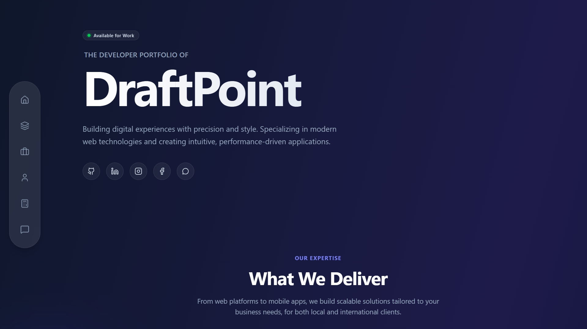
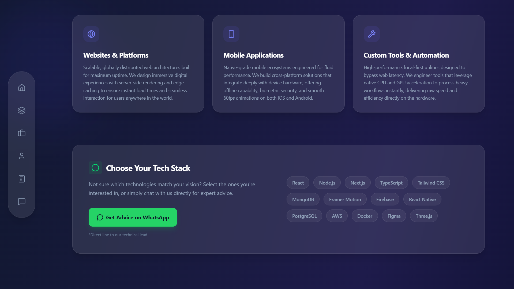
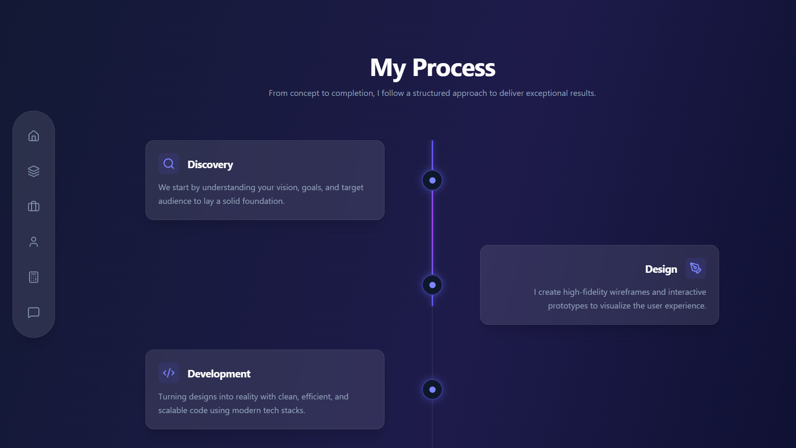
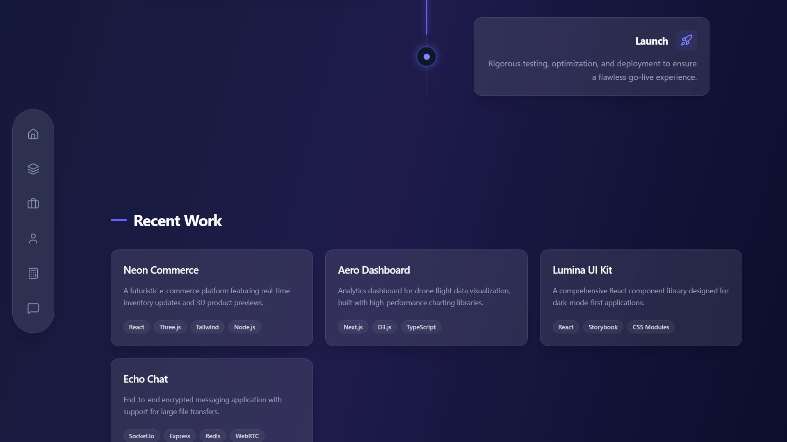
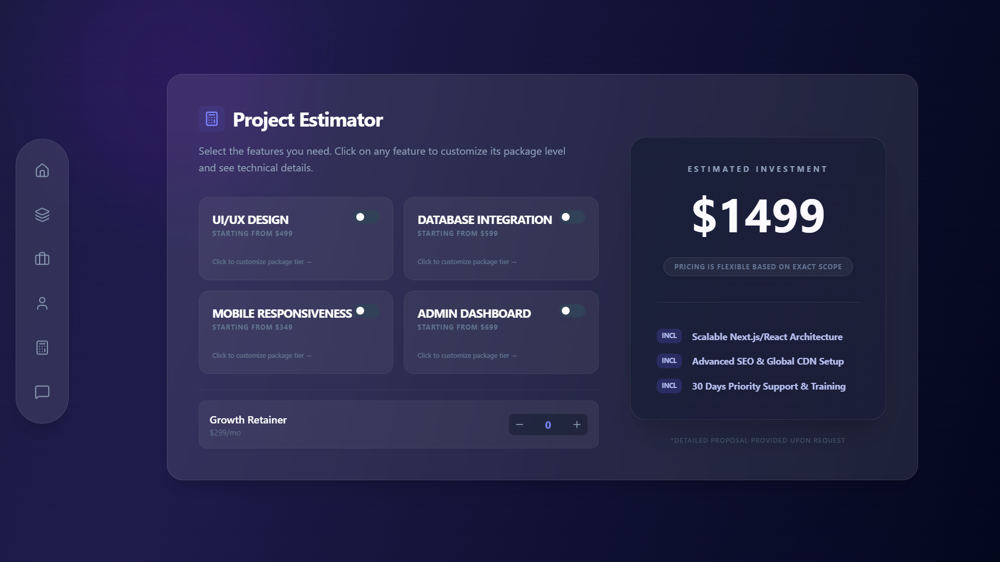

# DraftPoint

> **Professional Portfolio Platform** designed for high-end developers.
> Built with React, Tailwind CSS v4, and Framer Motion.

## Overview

**DraftPoint** is a next-generation portfolio platform that moves away from generic designs. It utilizes a **Deep Atmospheric Dark Mode**, physics-based motion, and a unique "Tag-Based" requirement gathering system for clients.



## Key Features

- **Deep Glassmorphism UI:** A premium "Slate/Midnight" aesthetic with extensive use of backdrop blurs and subtle gradients.
- **Floating Sidebar:** A unique, pill-shaped navigation bar that floats independently of the screen edges (transforms to a bottom bar on mobile).
- **Interactive Requirement Collector:** Clients type requirements ("Login page", "Payment Gateway") and they instantly convert into visual Tags/Chips.
- **Message Sending:** Integrated with specific Backend API to send professional project requests directly to your email.
- **Physics-Based Motion:** Smooth, staggered animations and hover effects powered by Framer Motion.

## Project Gallery

| Services | Process |
|:---:|:---:|
|  |  |

| Recent Work | Value Proposition |
|:---:|:---:|
|  |  |

| Project Estimator | Project Requirements |
|:---:|:---:|
|  |  |

## Tech Stack

- **Framework:** React 19 (Vite)
- **Styling:** Tailwind CSS v4
- **Animation:** Framer Motion
- **Icons:** Lucide React
- **Email Service:** Nodemailer + Vercel Serverless Functions

## Installation & Setup

1. **Clone the repository**
   ```bash
   git clone https://github.com/Chanii2024/DraftPoint.git
   cd DraftPoint
   ```

2. **Install dependencies**
   ```bash
   npm install
   ```

3. **Configure Environment Variables**
   Create a `.env` file in the root directory (use `.env.example` as a reference):
   ```env
   GMAIL_USER=your-email@gmail.com
   GMAIL_PASS=your-app-password
   ```

4. **Run the development server**
   ```bash
   npm run dev
   ```

5. **Build for production**
   ```bash
   npm run build
   ```

## Email Configuration

This project uses Vercel Serverless Functions to handle emails securely.
1. Create a `Gmail App Password` for your account.
2. Add `GMAIL_USER` and `GMAIL_PASS` to your Vercel Environment Variables.
3. The API endpoint is located at `/api/send-email.js`.

## Contributing

Contributions are welcome! Please feel free to submit a Pull Request.

## License

This project is open source and available under the [MIT License](LICENSE).